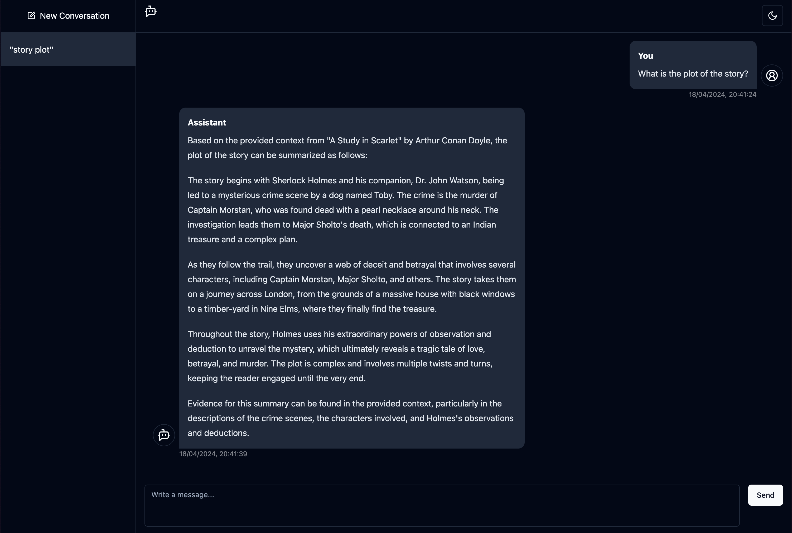

# docs-chat

## Introduction

This is a frontend application with a chat interface that enables you to have private conversations with your documents locally using Langchain JS & [llama3](https://ai.meta.com/blog/meta-llama-3/) via [Ollama](https://ollama.com/). It is designed to be privacy-focused and does not send any data to external servers.

This application is built with [SvelteKit](https://kit.svelte.dev) and the [shadcn-svelte](https://shadcn-svelte.com/) UI library. It currently supports pdf, csv, docx & txt files.

## How it works

This application uses the Langchain JS library to tokenize the documents you provide and stores the vector database in the `db` folder. It then sends your query and the document context to the llama3 model running on your machine via Ollama. The model then generates responses which are then sent back to the frontend and displayed in the chat interface.

The application is designed to be used locally and does not send any data to any external servers.

All chat history is stored in your browser's local storage.
  
## How to use / Installation

This repository requires you to have Ollama installed on your machine. You can find the installation instructions [here](https://ollama.com/). It also requires you to have NodeJS installed on your machine. You can find the installation instructions [here](https://nodejs.org/).

1. Clone the repository
2. Run `npm install`
3. Run `npm run dev`
4. Visit `localhost:5173` in your browser
5. Copy the documents you would like to chat with into the `documents` folder
6. Ensure that Ollama is running the llama3 model on your machine by running `ollama run llama3`
7. Start chatting with your documents!

## Contributing

If you would like to contribute to this project, please fork the repository and submit a pull request. I would love to have you contribute to this project!

## License

This project is licensed under the MIT License. You can find the license [here](LICENSE).
